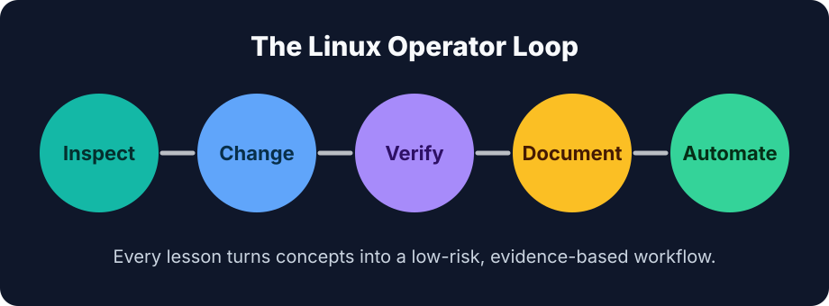

# Learn Linux

A practical, open-source Linux course from The Tech Hustle for learners who want to operate real systems, not just memorize commands.



## What changed

This repository is now structured as a full course site powered by [MkDocs Material](https://squidfunk.github.io/mkdocs-material/). The course includes a modern landing page, searchable lesson navigation, lab setup guidance, a syllabus, glossary, capstone project, QA checklist, and repeatable build commands.

## Course focus

Learn Linux teaches the operator loop:

1. Inspect the system.
2. Make the smallest safe change.
3. Verify with evidence.
4. Document the result.
5. Automate what becomes repeatable.

The lessons cover Linux fundamentals, shell usage, packages, users, permissions, processes, filesystems, logs, networking, routing, DNS, storage, containers, CI/CD, security, monitoring, performance analysis, and operations practice.

## Run locally

```bash
python3 -m pip install -r requirements.txt
mkdocs serve
```

Then open `http://127.0.0.1:8000`.

You can also use the Makefile:

```bash
make install
make serve
```

## Build

```bash
mkdocs build --strict
```

## Repository layout

```text
docs/
  index.md                 # Course landing page
  course/                  # Overview, setup, syllabus, glossary, capstone
  lessons/                 # Chapter and lesson Markdown
  project/                 # Modernization notes and QA checklist
  assets/                  # Course visuals
mkdocs.yml                 # Static course site configuration
scripts/modernize_course.py # Repeatable content cleanup/enrichment script
```

## Modernization notes

See [docs/project/modernization-notes.md](docs/project/modernization-notes.md) for the concern log and implementation decisions.

## License

MIT. See [LICENSE](LICENSE).
